# ARSW — (Java 21): **Immortals & Synchronization** — con UI Swing

**Escuela Colombiana de Ingeniería – Arquitecturas de Software**  
Laboratorio de concurrencia: condiciones de carrera, sincronización, suspensión cooperativa y *deadlocks*, con interfaz **Swing** tipo *Highlander Simulator*.


---

## Requisitos

- **JDK 21** (Temurin recomendado)
- **Maven 3.9+**
- SO: Windows, macOS o Linux

---

## Cómo ejecutar

### Interfaz gráfica (Swing) — *Highlander Simulator*

**Opción A (desde Main, modo ui)**
```bash
mvn -q -DskipTests exec:java -Dmode=ui -Dcount=8 -Dfight=ordered -Dhealth=100 -Ddamage=10
```

**Opción B (clase de la UI directamente)**
```bash
mvn -q -DskipTests exec:java   -Dexec.mainClass=edu.eci.arsw.highlandersim.ControlFrame   -Dcount=8 -Dfight=ordered -Dhealth=100 -Ddamage=10
```

**Parámetros**  
-Dcount=N → número de inmortales (por defecto 8)  
-Dfight=ordered|naive → estrategia de pelea (ordered evita *deadlocks*, naive los puede provocar)  
-Dhealth, -Ddamage → salud inicial y daño por golpe

### Demos teóricas (sin UI)
```bash
mvn -q -DskipTests exec:java -Dmode=demos -Ddemo=1  # 1 = Deadlock ingenuo
mvn -q -DskipTests exec:java -Dmode=demos -Ddemo=2  # 2 = Orden total (sin deadlock)
mvn -q -DskipTests exec:java -Dmode=demos -Ddemo=3  # 3 = tryLock + timeout (progreso)
```

---

## Controles en la UI

- **Start**: inicia una simulación con los parámetros elegidos.
- **Pause & Check**: pausa **todos** los hilos y muestra salud por inmortal y **suma total** (invariante).
- **Resume**: reanuda la simulación.
- **Stop**: detiene ordenadamente.

**Invariante**: con N jugadores y salud inicial H, la **suma total** de salud debe permanecer constante (salvo durante un update en curso). Usa **Pause & Check** para validarlo.

---

## Arquitectura (carpetas)

```
edu.eci.arsw
├─ app/                 # Bootstrap (Main): modes ui|immortals|demos
├─ highlandersim/       # UI Swing: ControlFrame (Start, Pause & Check, Resume, Stop)
├─ immortals/           # Dominio: Immortal, ImmortalManager, ScoreBoard
├─ concurrency/         # PauseController (Lock/Condition; paused(), awaitIfPaused())
├─ demos/               # DeadlockDemo, OrderedTransferDemo, TryLockTransferDemo
└─ core/                # BankAccount, TransferService (para demos teóricas)
```

---

# Actividades del laboratorio

## Parte I — (Antes de terminar la clase) wait/notify: Productor/Consumidor
1. Ejecuta el programa de productor/consumidor y monitorea CPU con **jVisualVM**. ¿Por qué el consumo alto? ¿Qué clase lo causa?  
2. Ajusta la implementación para **usar CPU eficientemente** cuando el **productor es lento** y el **consumidor es rápido**. Valida de nuevo con VisualVM.  
3. Ahora **productor rápido** y **consumidor lento** con **límite de stock** (cola acotada): garantiza que el límite se respete **sin espera activa** y valida CPU con un stock pequeño.

> Nota: la Parte I se realiza en el repositorio dedicado https://github.com/DECSIS-ECI/Lab_busy_wait_vs_wait_notify — clona ese repo y realiza los ejercicios allí; contiene el código de productor/consumidor, variantes con busy-wait y las soluciones usando wait()/notify(), además de instrucciones para ejecutar y validar con jVisualVM.


> Usa monitores de Java: **synchronized + wait() + notify/notifyAll()**, evitando *busy-wait*.

---

## Parte II — (Antes de terminar la clase) Búsqueda distribuida y condición de parada
Reescribe el **buscador de listas negras** para que la búsqueda **se detenga tan pronto** el conjunto de hilos detecte el número de ocurrencias que definen si el host es confiable o no (BLACK_LIST_ALARM_COUNT). Debe:
- **Finalizar anticipadamente** (no recorrer servidores restantes) y **retornar** el resultado.  
- Garantizar **ausencia de condiciones de carrera** sobre el contador compartido.

> Puedes usar AtomicInteger o sincronización mínima sobre la región crítica del contador.

---

## Parte III — (Avance) Sincronización y *Deadlocks* con *Highlander Simulator*
1. Revisa la simulación: N inmortales; cada uno **ataca** a otro. El que ataca **resta M** al contrincante y **suma M/2** a su propia vida.  
2. **Invariante**: con N y salud inicial H, la suma total debería permanecer constante (salvo durante un update). Calcula ese valor y úsalo para validar.  
3. Ejecuta la UI y prueba **“Pause & Check”**. ¿Se cumple el invariante? Explica.  
4. **Pausa correcta**: asegura que **todos** los hilos queden pausados **antes** de leer/imprimir la salud; implementa **Resume** (ya disponible).  
5. Haz *click* repetido y valida consistencia. ¿Se mantiene el invariante?  
6. **Regiones críticas**: identifica y sincroniza las secciones de pelea para evitar carreras; si usas múltiples *locks*, anida con **orden consistente**:
   ```java
   synchronized (lockA) {
     synchronized (lockB) {
       // ...
     }
   }
   ```
7. Si la app se **detiene** (posible *deadlock*), usa **jps** y **jstack** para diagnosticar.  
8. Aplica una **estrategia** para corregir el *deadlock* (p. ej., **orden total** por nombre/id, o **tryLock(timeout)** con reintentos y *backoff*).  
9. Valida con **N=100, 1000 o 10000** inmortales. Si falla el invariante, revisa la pausa y las regiones críticas.  
10. **Remover inmortales muertos** sin bloquear la simulación: analiza si crea una **condición de carrera** con muchos hilos y corrige **sin sincronización global** (colección concurrente o enfoque *lock-free*).  
11. Implementa completamente **STOP** (apagado ordenado).

---

## Entregables

1. **Código fuente** (Java 21) con la UI funcionando.  
2. **Informe de laboratorio en formato pdf** con:
   - Parte I: diagnóstico de CPU y cambios para eliminar espera activa.  
   - Parte II: diseño de **parada temprana** y cómo evitas condiciones de carrera en el contador.  
   - Parte III:  
     - Regiones críticas y estrategia adoptada (**orden total** o **tryLock+timeout**).  
    - Evidencia de *deadlock* (si ocurrió) con jstack y corrección aplicada.  
     - Validación del **invariante** con **Pause & Check** (distintos N).  
     - Estrategia para **remover inmortales muertos** sin sincronización global.
3. Instrucciones de ejecución si cambias *defaults*.

---

## Criterios de evaluación (10 pts)

- (3) **Concurrencia correcta**: sin *data races*; sincronización bien localizada; no hay espera activa.  
- (2) **Pausa/Reanudar**: consistencia del estado e invariante bajo **Pause & Check**.  
- (2) **Robustez**: corre con N alto; sin ConcurrentModificationException, sin *deadlocks* no gestionados.  
- (1.5) **Calidad**: arquitectura clara, nombres y comentarios; separación UI/lógica.  
- (1.5) **Documentación**: **RESPUESTAS.txt** claro con evidencia (dumps/capturas) y justificación técnica.

---

## Tips y configuración útil

- **Estrategias de pelea**:  
  - -Dfight=naive → útil para **reproducir** carreras y *deadlocks*.  
  - -Dfight=ordered → **evita** *deadlocks* (orden total por nombre/id).
- **Pausa cooperativa**: usa PauseController (Lock/Condition), **sin** suspend/resume/stop.  
- **Colecciones**: evita estructuras no seguras; prefiere inmutabilidad o colecciones concurrentes.  
- **Diagnóstico**: jps, jstack, **jVisualVM**; revisa *thread dumps* cuando sospeches *deadlock*.  
- **Virtual Threads**: favorecen esperar con bloqueo (no *busy-wait*); usa timeouts.

---

## Cómo correr pruebas

```bash
mvn clean verify
```

Incluye compilación y pruebas JUnit.

---

## Créditos y licencia

Laboratorio basado en el enunciado histórico del curso (Highlander, Productor/Consumidor, Búsqueda distribuida), modernizado a **Java 21**.  
<a rel="license" href="http://creativecommons.org/licenses/by-nc/4.0/"></a><br />Este contenido hace parte del curso Arquitecturas de Software (ECI) y está licenciado como <a rel="license" href="http://creativecommons.org/licenses/by-nc/4.0/">Creative Commons Attribution-NonCommercial 4.0 International License</a>.  
---


---
# REPORTE DE LABORATORIO
### Nombres:  
  - Laura Alejandra Venegas Piraban  
  - Sergio Alejandro Idarraga Torres  

## PARTE I — LAB 3 ARSW  

## Productor / Consumidor — wait/notify

---

## 1. Monitoreo de CPU con jVisualVM

Se ejecutó el programa Productor/Consumidor y se monitoreó el consumo de CPU utilizando jVisualVM.

### Modo Spin

En modo spin, se obtuvo un consumo de CPU del 13.2%.

En este modo se utiliza la clase BusySpinQueue.

<p align="center">
  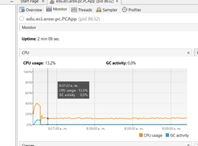
</p>

### Modo Monitor

En modo monitor, el consumo fue significativamente menor: 2.3%.

En este caso se ejecuta la clase BoundedBuffer, que implementa sincronización mediante wait() y notify().

<p align="center">
  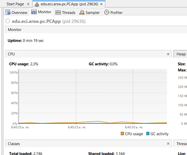
</p>

**¿Por qué ocurre el alto consumo?**

El alto consumo se debe principalmente a la implementación de bucles que no tiene condición de salida y por ende se sigue ejecutando.  

Esto ocurre en los métodos take() y put() de la clase BusySpinQueue.

<p align="center">
  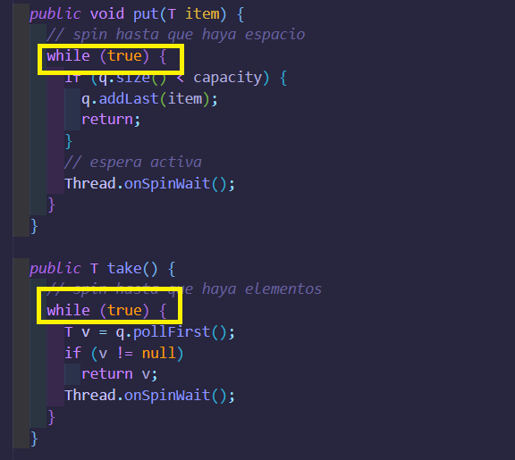
</p>

---

## 2. Productor lento y consumidor rápido

Se ajustó la implementación para usar CPU de manera más eficiente cuando:

- El productor es lento.
- El consumidor es rápido.

Para lograrlo:

- Se aumentó el valor de delayMs del productor.
- Se mantuvo igual el tiempo del consumidor.  

#### Productor lento

<p align="center">
  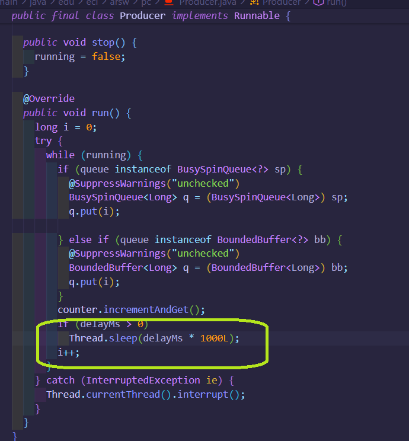
</p>

#### Consumidor rápido

<p align="center">
  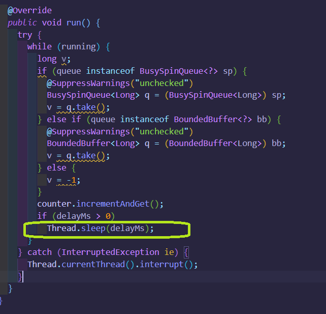
</p>

### Resultados en modo Monitor

<p align="center">
  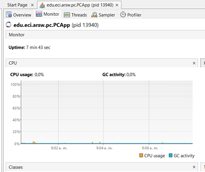
</p>

Se observó un menor uso de CPU, aunque el tiempo total de ejecución aumentó debido a la lentitud del productor.

### Resultados en modo Spin

<p align="center">
  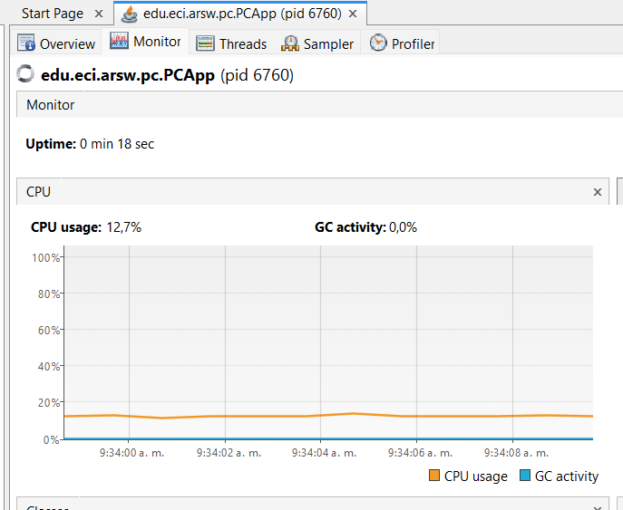
</p>

En este modo el consumo de CPU fue considerablemente mayor, confirmando que la espera activa es menos eficiente.

---

## 3. Productor rápido y consumidor lento (cola acotada)

Se configuró el escenario contrario:

- Productor rápido.
- Consumidor lento.
- Límite de stock.

### Cambios realizados

#### Productor rápido

<p align="center">
  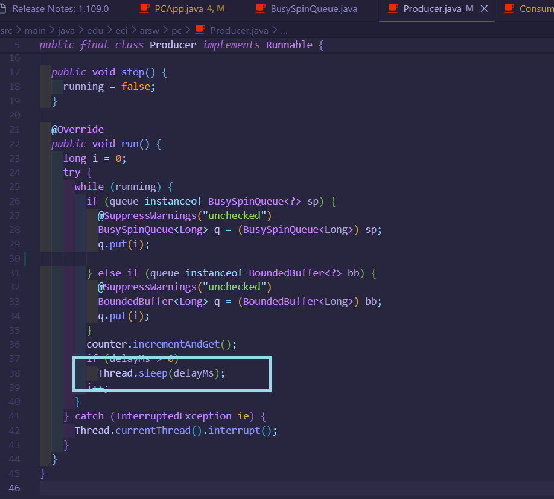
</p>

#### Consumidor lento

<p align="center">
  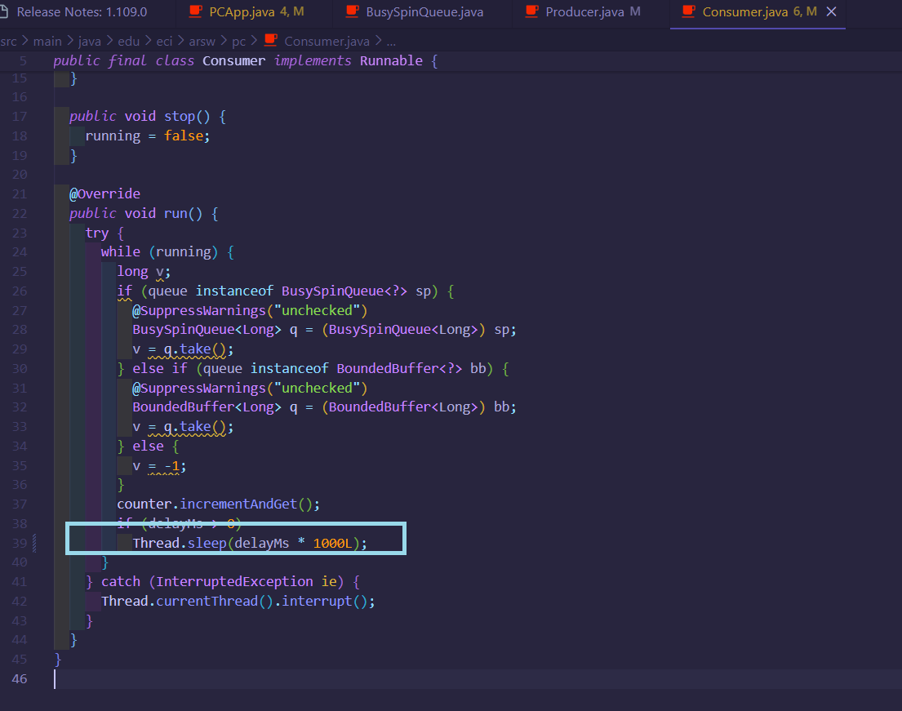
</p>

### Límite de stock

Se modificó el valor por defecto del atributo capacity, que era 16, y se cambió a 8 para trabajar con una cola más pequeña.

<p align="center">
  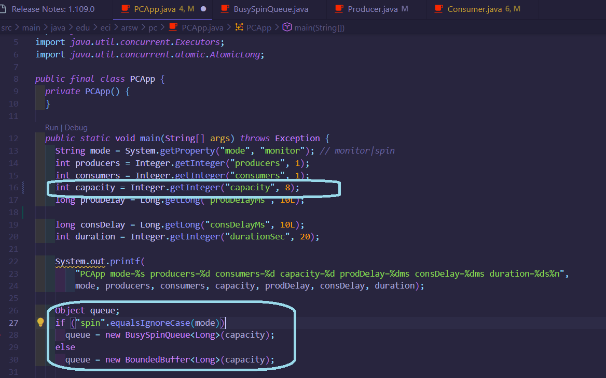
</p>

### Resultados en modo Monitor

<p align="center">
  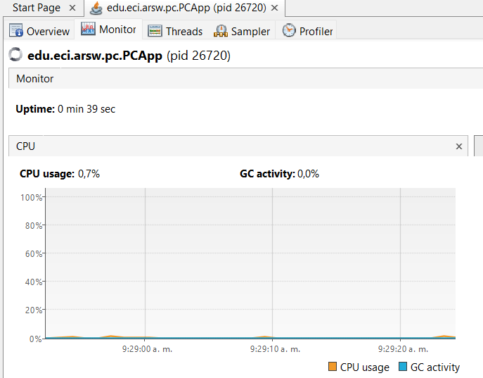
</p>

El límite de stock se respetó correctamente sin necesidad de espera activa, gracias al uso de wait() y notify().

### Resultados en modo Spin

<p align="center">
  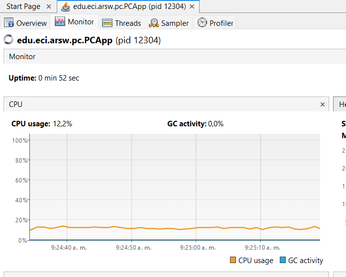
</p>

En comparación con el modo monitor, el modo spin presentó un uso considerablemente mayor de CPU debido a la espera activa.

---  
## Parte II — (Antes de terminar la clase) Búsqueda distribuida y condición de parada
Reescribe el **buscador de listas negras** para que la búsqueda **se detenga tan pronto** el conjunto de hilos detecte el número de ocurrencias que definen si el host es confiable o no (BLACK_LIST_ALARM_COUNT). Debe:
- **Finalizar anticipadamente** (no recorrer servidores restantes) y **retornar** el resultado.  
- Garantizar **ausencia de condiciones de carrera** sobre el contador compartido.

> Puedes usar AtomicInteger o sincronización mínima sobre la región crítica del contador.

### LA URL del repositorio de BLACK_LIST_VALIDATOR ES: https://github.com/LauraVenegas6/PARALLELISM-JAVA_THREADS-INTRODUCTION_BLACKLISTSEARCH.git  

En el anterior laboratorio teniamos que para que un host fuera confiable o no el  BLACK_LIST_ALARM_COUNT debia ser 5, si es mayor de 5 no es confiable.  

Lo primero que hacemos es verificar la clase hostBackListValidator, áca tenemos dos métodos (checkHost), uno donde solo un hilo lo manejas este es secuencial, y el otro lo hace de forma paralela. Este último es importante y en el que nos vamos a enfocar pues varios hilos trabajan en él y es acá donde hacemos la cuenta global de ocurrencias para saber si es confiable o no.   
Lo que hacemos es cambiar el tipo del contador  globalOccurrences a AtomicInteger, puest este asegura que el contador global funcione correctamente en este entorno que es multihilo, sin necesidad de sincronización manual.  

<p align="center">
  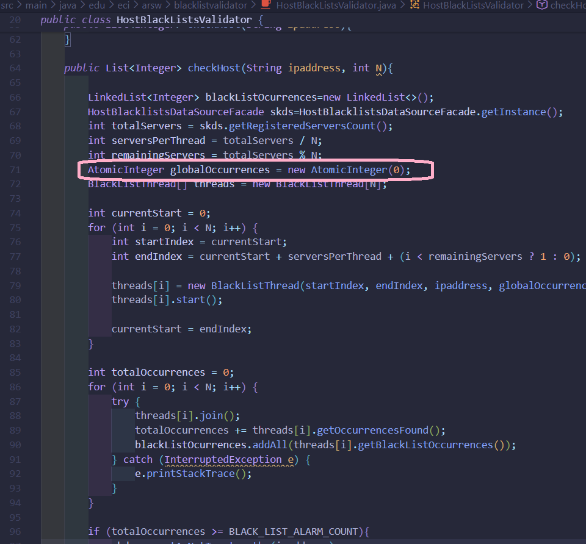
</p>

Lo que hacemos es verificar que si globalOccurrences.get() >= BLACK_LIST_ALARM_COUNT ese será nuestra alarma para parar y no segir contando pues ya tendriamos que es una IP no confiable.  

Tambien nos enfocamos en la clase BackListThread donde se agregó un contador global de ocurrencias (AtomicInteger globalOccurrences) compartido entre todos los hilos, para detectar rápidamente cuando se alcanza el límite de listas negras. Antes de revisar cada servidor, el hilo consulta el valor de globalOccurrences, se detiene si ya se llegó al límite y devuelve el resultado.  

<p align="center">
  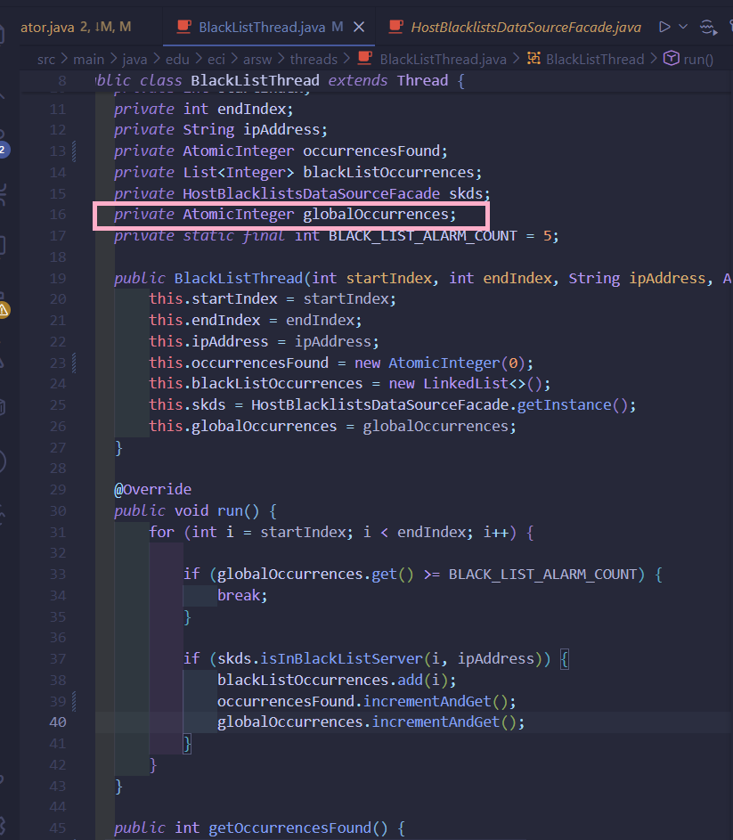
</p>  

Respecto a las condiciones de carrera nosotros aseguramos su ausencia sobre el contador compartido usando AtomicInteger, este ofrece métodos atómicos que usamos como incrementAndGet y get, que permiten que varios hilos incremente y consulten al mismo tiempo sin interferirse ni producir errores de concurrencin, con esto no usamos synchronized ni bloqueos manuales y termina siendo Thread-safe.  

## Parte III — (Avance) Sincronización y *Deadlocks* con *Highlander Simulator*

1. Revisa la simulación: N inmortales; cada uno **ataca** a otro. El que ataca **resta M** al contrincante y **suma M/2** a su propia vida.  
2. **Invariante**: con N y salud inicial `H`, la suma total debería permanecer constante (salvo durante un update). Calcula ese valor y úsalo para validar.  


Formula: *SaludTotal = (N × H) − (Peleas × D/2)*

La salud total del sistema no se mantiene constante, sino que esta por cada pelea debe de ir disminuyendo con el tiempo; esto se debe a que el sistema pierde energia en cada pelea y el atacante quita una cantidad completa de vida mientras que solo recupera la mitad del daño que hace. Si la suma de la vida de los inmortales cumple con este invariante, podemos decir que esta correcto. 

3. Ejecuta la UI y prueba **“Pause & Check”**. ¿Se cumple el invariante? Explica.  


Podemos decir que el invariante se cumple a la perfección al utilizar la función "Pause & Check", y la razón de esto está en el mecanismo de sincronización que podemos observa en la imagen del código. Al pulsar el botón, el sistema no realiza el cálculo de inmediato, sino que primero emite una orden global de detención y entra en un estado de espera estricta (utilizando un bloqueo wait() o await()); la interfaz se detiene intencionalmente y no avanza hasta recibir la confirmación absoluta de que el contador de inmortales detenidos coincide con el total de inmortales vivos. De esta forma, el cálculo de la salud total solo se ejecuta cuando tenemos la certeza de que todos los hilos están completamente "dormidos" sin nadie atacando ni curándose en ese instante, lo cual garantiza que el estado de los datos sea consistente y evita cualquier error matemático que ocurriría si leyéramos el estado de un inmortal justo a mitad de una pelea.

4. **Pausa correcta**: asegura que **todos** los hilos queden pausados **antes** de leer/imprimir la salud; implementa **Resume** (ya disponible).  


Sí, la consistencia del sistema es robusta y el invariante se mantiene inalterable, incluso bajo condiciones de estrés como presionar los botones "Reanudar" y "Pausar" repetida y rápidamente.

La estabilidad del sistema no es casualidad, sino el resultado de un diseño de reinicio de estado limpio. La clave técnica reside en la lógica del método resume(). Cada vez que se ordena al juego continuar, el sistema no solo libera los hilos para que sigan peleando, sino que realiza una acción crítica: fuerza el reinicio del contador de "hilos pausados" a cero.

Este reinico es fundamental. Porque sin esto,si el usuario pausara de nuevo muy rápido, el sistema podría confundirse y creer que algunos hilos siguen detenidos desde la pausa anterior, lo que llevaría a sumar la salud mientras los inmortales se mueven. Al resetear el contador a cero obligatoriamente en cada reanudación, garantizamos que cada nueva pausa sea un evento fresco e independiente, obligando al sistema a esperar nuevamente la confirmación de parada de todos y cada uno de los inmortales antes de atreverse a verificar el invariante.

5. Haz *click* repetido y valida consistencia. ¿Se mantiene el invariante?  


Sí, la coherencia del sistema no se altera aunque el botón de pausar y reanudar se presione muchas veces seguidas o muy rápido. Esto funciona porque cada vez que se vuelve a iniciar la simulación, el programa reinicia el contador que lleva el registro de cuántos inmortales están detenidos. Es decir, empieza nuevamente desde cero.

Al hacer esto, el sistema no mezcla información de pausas anteriores. En cada nueva pausa vuelve a esperar que todos los inmortales estén completamente detenidos antes de calcular la salud total. Gracias a este procedimiento, los valores siempre se calculan en un momento estable y los resultados coinciden correctamente en cada verificación.

6. **Regiones críticas**: identifica y sincroniza las secciones de pelea para evitar carreras; si usas múltiples *locks*, anida con **orden consistente**:
   ```java
   synchronized (lockA) {
     synchronized (lockB) {
       // ...
     }
   }
   ```

   

Identificamos que el momento crítico del sistema ocurre exactamente cuando dos personajes se atacan, modifican su salud y registran la pelea en el marcador. Para evitar que los datos se mezclen o se calculen mal si varios intentan interactuar al mismo tiempo, lo que hicimos fue asegurar o bloquear temporalmente a los dos involucrados antes de que se hagan daño. La clave para que esta protección no haga que el juego se quede congelado 

7. Si la app se **detiene** (posible *deadlock*), usa **`jps`** y **`jstack`** para diagnosticar.  

Si la aplicación se llega a detener por completo, nos encontramos ante un bloqueo crítico donde los personajes se quedan atrapados en un círculo infinito de espera sin poder avanzar. Para diagnosticar esto, usamos la herramienta jps para localizar el número del proceso de nuestra aplicación que estaba corriendo en nuestro computador, y luego utilizamos jstack para extraer un reporte detallado del estado de todos los participantes en ese instante.

Como podemos ver en la siguiente imagen:


8. Aplica una **estrategia** para corregir el *deadlock* (p. ej., **orden total** por nombre/id, o **`tryLock(timeout)`** con reintentos y *backoff*).  


Aplicamos una estrategia de ordenamiento, basándonos en el nombre de cada personaje. En lugar de permitir que interactúen sin control, establecimos una regla de tránsito estricta para el momento de las peleas y es que el sistema siempre debe asegurar primero al inmortal cuyo nombre aparezca antes en orden alfabético, sin importar quién inició el ataque. Al obligar a todos los participantes a seguir exactamente la misma fila y el mismo orden antes de cualquier enfrentamiento, eliminamos por completo la posibilidad de que se queden esperándose mutuamente en un círculo infinito.  Con esta regla que parece simple, garantizamos que la simulación fluya de manera continua, segura y sin bloqueos.

9. Valida con **N=100, 1000 o 10000** inmortales. Si falla el invariante, revisa la pausa y las regiones críticas.  

**N=100** 


**N=1000**


10. **Remover inmortales muertos** sin bloquear la simulación: analiza si crea una **condición de carrera** con muchos hilos y corrige **sin sincronización global** (colección concurrente o enfoque *lock-free*).

La estrategia segura que se aplicó en la clase Immortal fue simplemente ignorarlos. Mediante una sencilla regla, si la salud de un personaje llega a cero, el sistema bloquea automáticamente cualquier tipo de interacción con él; de esta forma, el personaje caído se convierte en un participante inactivo que ya no ataca ni recibe daño, lo que permite que la simulación siga fluyendo de manera estable sin necesidad de alterar los registros originales.

11. Implementa completamente **STOP** (apagado ordenado).


Para implementar el botón STOP, no decidimos cerrar el programa de manera brusca, sino que se creó un procedimiento organizado para finalizar la simulación sin dejar nada a medias.

- Primero, el sistema les indica a todos los inmortales que deben detenerse, cambiando una señal interna que les informa que el juego ya terminó.

- Segundo, si la simulación estaba en pausa, se reanuda temporalmente para asegurarse de que todos los personajes reciban la orden de finalizar. Así se evita que alguno quede detenido esperando indefinidamente.

---

